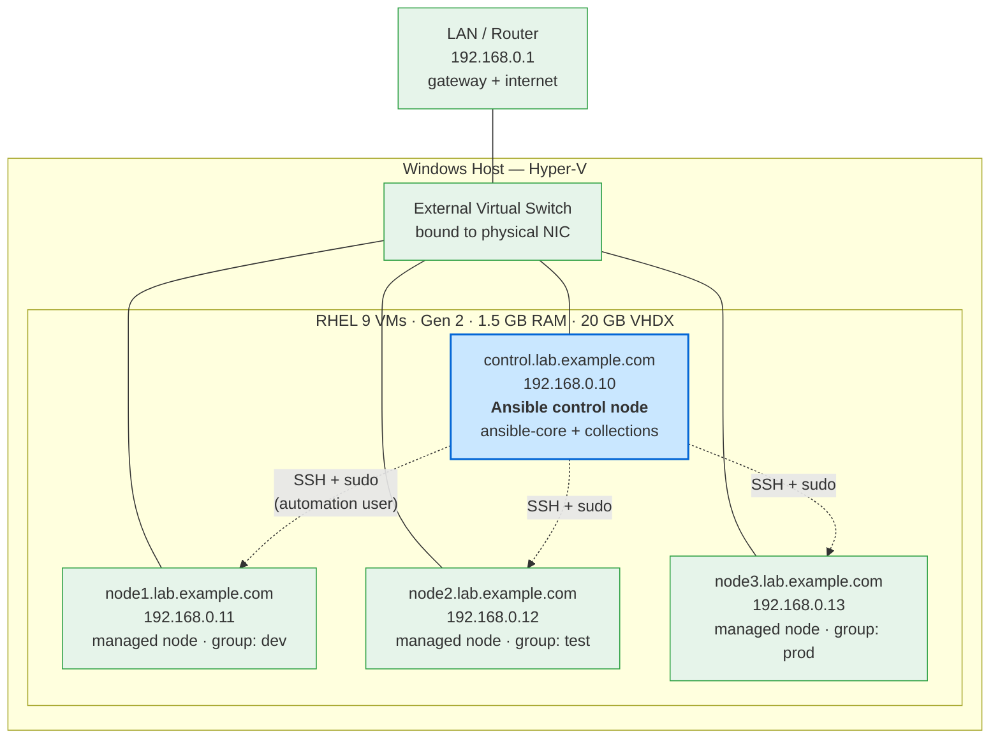

# RHCE EX294 Ansible Lab

A four-node Ansible practice environment for the **Red Hat Certified Engineer (EX294)** exam, built from scratch on **Hyper-V** with **RHEL 9**. One control node manages three RHEL 9 nodes over SSH, using a dedicated automation user with passwordless privilege escalation.

This README documents the full build so the lab can be reproduced end to end.

---

## Architecture



Solid lines are the physical/virtual network path (all VMs sit on one external switch alongside the LAN). Dotted lines are the Ansible management flow: the control node reaches each managed node over SSH as the `automation` user and escalates to root with `sudo`.

---

## Environment

| VM | Hostname | IP | Role | Inventory group |
|----|----------|-----|------|-----------------|
| control | control.lab.example.com | 192.168.0.10 | Ansible control node | — |
| node1 | node1.lab.example.com | 192.168.0.11 | Managed node | dev |
| node2 | node2.lab.example.com | 192.168.0.12 | Managed node | test |
| node3 | node3.lab.example.com | 192.168.0.13 | Managed node | prod |

**Per-VM specs:** Hyper-V Generation 2, Secure Boot disabled, 1.5 GB (1536 MB) fixed RAM (Dynamic Memory off), 20 GB VHDX, RHEL 9. All four attached to an **External Virtual Switch** so they share the LAN and reach the internet directly.

---

## Build Steps

### 1. Networking — External Virtual Switch

Created an external switch in Hyper-V bound to the host's physical NIC, with management-OS sharing enabled so the host keeps connectivity.

```powershell
New-VMSwitch -Name "External Virtual Switch" -NetAdapterName "Ethernet" -AllowManagementOS $true
```

### 2. Build the control node

Created the first VM (Gen 2, Secure Boot off, 1536 MB fixed RAM, 20 GB disk) and installed RHEL 9 from ISO, setting the hostname to `control.lab.example.com` during install.

### 3. Clone the managed nodes

Shut down the control node and cloned its disk three times from the golden image, creating `node1`–`node3` from the same VHDX:

```powershell
$src = "C:\Users\Easy\Documents\Hyper-V\Virtual Hard Disks\control.vhdx"
$dir = "C:\Users\Easy\Documents\Hyper-V\Virtual Hard Disks"
foreach ($n in "node1","node2","node3") {
  Copy-Item $src "$dir\$n.vhdx"
  New-VM -Name $n -Generation 2 -MemoryStartupBytes 1536MB -VHDPath "$dir\$n.vhdx" -SwitchName "External Virtual Switch"
  Set-VMMemory $n -DynamicMemoryEnabled $false
  Set-VMFirmware $n -EnableSecureBoot Off
}
```

### 4. Give each clone a unique identity

Clones share the origin's hostname and machine-id, so both were regenerated on each node:

```bash
sudo hostnamectl set-hostname node1.lab.example.com   # node2 / node3 respectively
sudo rm -f /etc/machine-id && sudo systemd-machine-id-setup
```

### 5. Static IPs and name resolution

Assigned a fixed IP on each node with `nmcli` (`.10`–`.13`):

```bash
sudo nmcli con mod "Wired connection 1" \
  ipv4.addresses 192.168.0.10/24 \
  ipv4.gateway 192.168.0.1 \
  ipv4.dns 192.168.0.1 \
  ipv4.method manual
sudo nmcli con up "Wired connection 1"
```

Added a shared `/etc/hosts` on every node so they resolve each other by name:

```bash
sudo tee -a /etc/hosts >/dev/null <<'EOF'
192.168.0.10  control.lab.example.com control
192.168.0.11  node1.lab.example.com node1
192.168.0.12  node2.lab.example.com node2
192.168.0.13  node3.lab.example.com node3
EOF
```

### 6. Automation user with passwordless sudo

Created a dedicated `automation` user on **all** nodes and granted passwordless privilege escalation:

```bash
sudo useradd -m automation
echo 'automation ALL=(ALL) NOPASSWD:ALL' | sudo tee /etc/sudoers.d/automation
sudo chmod 440 /etc/sudoers.d/automation
echo 'automation:redhat123' | sudo chpasswd
```

### 7. SSH key-based access (control → nodes)

Generated a key on the control node as `automation` and distributed it to every node:

```bash
ssh-keygen -t ed25519 -N '' -f ~/.ssh/id_ed25519
for h in control node1 node2 node3; do ssh-copy-id automation@$h; done
```

### 8. Install Ansible on the control node

Registered the system, installed `ansible-core`, and added the collections and system roles the EX294 objectives rely on:

```bash
sudo subscription-manager register
sudo subscription-manager attach --auto
sudo dnf install -y ansible-core
ansible-galaxy collection install ansible.posix community.general
sudo dnf install -y rhel-system-roles
```

> `redhat.rhel_system_roles` ships as the **`rhel-system-roles` RPM** (installed to `/usr/share/ansible/collections/...`), not via Ansible Galaxy. Collections were installed as the `automation` user so playbooks run by that user resolve them.

### 9. Project directory, config, and inventory

Created a working directory with a local `ansible.cfg` and a static inventory grouped into `dev` / `test` / `prod`.

**`~/ex294/ansible.cfg`**
```ini
[defaults]
inventory = ./inventory
remote_user = automation
host_key_checking = False

[privilege_escalation]
become = True
become_method = sudo
become_user = root
become_ask_pass = False
```

**`~/ex294/inventory`**
```ini
[dev]
node1.lab.example.com

[test]
node2.lab.example.com

[prod]
node3.lab.example.com

[webservers:children]
prod

[all:vars]
ansible_python_interpreter=/usr/bin/python3
```

---

## Verification

Run from `~/ex294` as the `automation` user:

```bash
ansible all -m ping
ansible all -m command -a 'id' -b
```

Expected results — a green `SUCCESS` / `"pong"` from every node, and `uid=0(root)` under `-b`, confirming SSH, Python, and privilege escalation all work across the fleet:

```
node1.lab.example.com | SUCCESS => { "ping": "pong" }
node2.lab.example.com | SUCCESS => { "ping": "pong" }
node3.lab.example.com | SUCCESS => { "ping": "pong" }

node1.lab.example.com | CHANGED | rc=0 >>
uid=0(root) gid=0(root) groups=0(root) ...
```

---

## Notes

- **Checkpoints:** each VM is snapshotted in a clean state so disk/service labs are a one-click revert.
- **Static IP range:** `192.168.0.10`–`.13` are kept outside the router's DHCP pool to avoid address conflicts.
- **Credentials:** the lab password above is for an isolated practice environment only. Never commit real secrets, Ansible Vault password files are excluded via `.gitignore`.
